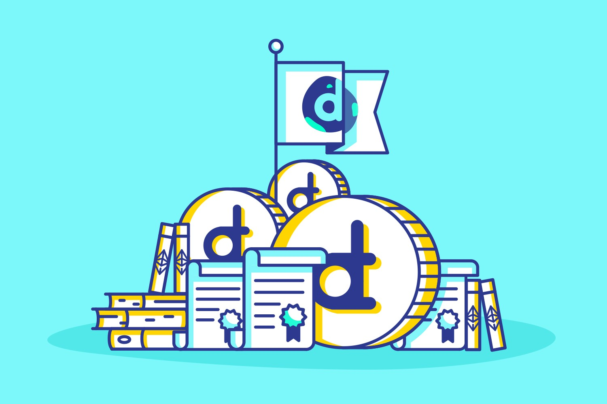

# Articles

## **Editorials**
> An editorial is an article written either by the editorial staff of the newspaper or by a contributor. It can be any written document,  for example a technical specification documentation or a letter to the public.

[<h2>The district0x network in a nutshell</h2>](editorial/the_district0x_in_a_nutshell.md) |
:-----------|
[_Editorial_](#editorials) |
 |
_Author [Brady McKenna / @bradymck](https://github.com/bradymck)_ |
The district0x project is building a general purpose framework of smart contracts and front end libraries for the purpose of deploying, operating, and governing communal marketplaces. The network is powered by Ethereum smart contracts, ‘Aragon’ governance and the distributed file system ‘IPFS’. The community has asked for a simple breakdown of the district0x network and the following post is based on this community feedback. Let’s dive in… |
[Read More](editorial/the_district0x_in_a_nutshell.md) |

## **Opinion pieces**
> An opinion piece is an article that mainly reflects the author's opinion about the subject. Opinion pieces in the newspaper are often written by a subject-matter expert, a person with a unique perspective on an issue.

[<h2>TCRs - The Curation Protocol That Separates the Wheat from the Chaff</h2>](opinion/TCRs_Separating_the_Wheat_from_the_Chaf.md) |
:-----------|
[_Opinion pieces_](#opinion-pieces) |
 |
_Author [Aaron Foster / @Shyblugs](https://github.com/shyblugs)_ |
On the internet, as on the street, reputation is everything. Whether your digital identity comprises a mugshot or a 256 bit hexadecimal address, validation and verification are still a requisite. Even on the decentralized, pseudonymous web, in which real world identities are optional, reputation still counts. The web 3.0 isn’t about concealing everyone under a cloak of invisibility; rather it’s about giving individuals the right to privacy. The freedom to choose which data they disclose to which platforms, rather than having it hoovered up by every app they install and website they join, to be stored in centralized silos that are a honeypot to hackers. |
[Read More](opinion/TCRs_Separating_the_Wheat_from_the_Chaf.md) |

[<h2>How can Aragon create a fairer world?</h2>](opinion/how_aragon_create_a_fairer_world.md) |
:-----------|
[_Opinion pieces_](#opinion-pieces) |
 |
_Author [Zurpples / @Zurpples](https://github.com/Zurpples)_ |
Suddenly it’s 2020. We gaze over a border station across the DMZ. This is a land that was thought to be beyond law or justice. Now (due to tokenization and the Aragon blockchain) things are looking up. A new hotel gleams in the distance of a new city where North and South are collaborating. The entire map of the city (and who did what) is stored securely in the blockchain, crypto is the currency of the region, and people trying to get rich off of exploitation are quickly found out. |
[Read More](opinion/how_aragon_create_a_fairer_world.md) |

[<h2>Thoughts On Governance and Network Effects</h2>](opinion/thoughts_on_governance_network_effects.md) |
:-----------|
[_Opinion pieces_](#opinion-pieces) |
 |
_Author [Luke Duncan / @lkngtn](https://github.com/lkngtn)_ |
This post discusses governance and its impact on network effects and why both relate to how value flows and is captured within tokenized blockchain networks. |
[Read More](opinion/thoughts_on_governance_network_effects.md) |

## **Columns**
> A column is a recurring piece or article in the newspaper where a writer expresses their own opinion in few columns allotted to them by the newspaper organisation.

> Columns are written by columnists who are dedicated to contribute quality content for an extended time, usually on the same subject area or theme each time – that typically contains the author's opinion or point of view.

[<h2>Looking for interested contributors</h2>](columns/submit.md) |
:-----------|
[_Column_](#columns) |
 |
_Author [You!](https://aragon.one) on Jan 17_ |
[**Want to start a regular column on Aragon Monthly?**](columns/submit.md) |
[Read More](columns/submit.md) |
