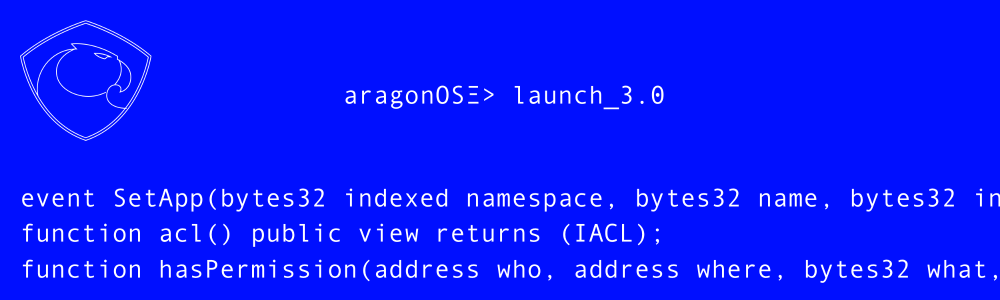
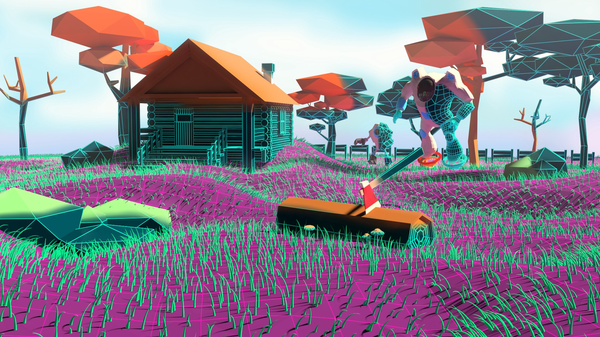

# Aragon Monthly
#### The community curated digital newspaper about DAOs and the Aragon ecosystem
#### Issue 01, February 2nd 2018
___
> **Content curation is the process of gathering information relevant to a particular topic or area of interest.**

Aragon Monthly is **created by the community, for the community**.

**Anyone can contribute** by creating or requesting new content regarding Decentralized Autonomous Organizations or about anything related to the Aragon ecosystem.

For more information, see [**How does this work?**](/info/index.md#how-does-this-work) and [**How can I contribute?**](/info/index.md#how-can-i-contribute)
___
## [Recent News](news/index.md)

[**We are proud to announce the start of P2P Models**](https://p2pmodels.eu/) | [**Introducing aragonOS 3.0 alpha**](https://blog.aragon.one/introducing-aragonos-3-0-alpha-the-new-operating-system-for-protocols-and-dapps-348f7ac92cff) | [**Launch of Aragon Nest**](https://blog.aragon.one/launch-of-aragon-nest-8d42d1a37595) |
:-----------:|:-----------:|:-----------:|
[_DAOs_](news/daos.md) | [_Aragon_](news/aragon.md) | [_Aragon_](news/aragon.md) |
 |  |  |
_Author unknown on Jan 31_ | _Author [Jorge Izquierdo](https://blog.aragon.one/@izqui9) on Jan 25_ | _Author [Tatu Kärki](https://blog.aragon.one/@Smokyish) on Jan 24_ |
**P2P Models is a €1.5M 5-year ERC research project to build decentralized, democratic, and sustainable Collaborative Economy organizations.** The Collaborative Economy is rapidly expanding, but it is dominated by centralized web platforms which hold user data and concentrate all decision-making power and profits. The idea of the P2P Models project is to tackle these issues, replacing the centralized web platform with DAOs on the blockchain, so we reduce the difference of power between the "infrastructure owner" and the user community. | **The new operating system for protocols and DApps.** aragonOS is smart contract development framework with a very strong focus on governance and upgradeability. This architecture can be used by any complex DApp or protocol and it allows extendability with the ability to plug in any Aragon governance module. It was originally designed to build modular DAOs, but we ended up abstracting it more and more to the point where it would be useful as the fundamental building block of any decentralized project. | **Grants program is open for submissions.** At the end of 2017 we presented Aragon Nest to the community and encouraged people to start coming up with ideas for the launch.In that blog post, Introducing Aragon Nest, we outlined the reasons and goals of the program.Now the time has come to launch the program. Submissions are now open for teams to request funding as well as come up with proposals for grants. |
[Read More](https://p2pmodels.eu/) | [Read More](https://blog.aragon.one/introducing-aragonos-3-0-alpha-the-new-operating-system-for-protocols-and-dapps-348f7ac92cff) | [Read More](https://blog.aragon.one/launch-of-aragon-nest-8d42d1a37595) |

[**An Introduction to district0x**](https://cryptoslate.com/introduction-district0x-network-decentralized-communities) | [**Aragon Q4 Transparency Report**](https://blog.aragon.one/aragon-q4-transparency-report-df3195ba6fd3) | [**Decentraland Project Updates — January 31st**](https://blog.decentraland.org/decentraland-project-updates-january-31st-a99258b90642) |
:-----------:|:-----------:|:-----------:|
[_district0x_](news/district0x.md) | [_Aragon_](news/aragon.md) | [_Ecosystem_](news/ecosystem.md) |
 |  |  |
_Author [Matt Breen](https://cryptoslate.com/author/matt-breen/) on Jan 24_ | _Author [Tatu Kärki](https://blog.aragon.one/@Smokyish) on Jan 17_ | _Author [Eric Schallock](https://blog.decentraland.org/@schallock) on Feb 1_ |
**district0x is a network of decentralized markets and communities.** When it comes to (hopefully more successful) platforms enabling the creation and running of decentralised organisations, few can match district0x. Its team have a vision of a digital realm free of the traditional governance structures that we’ve become so accustomed to, and are well on their way to releasing a polished framework to create and run blockchain-based businesses. | **A recap of what has been going on with Aragon during Q4 2017** As per our Transparency Model, we do quarterly Transparency Reports of our use of funds and about the overall progress of the project. | **News and updates from the Decentraland project.** _We’ve launched our developer CLI!_ We recently released our first development tool. _LAND Deployment._ Now that the Terraform Event has concluded, we’ve completed the process of distributing all LAND to auction participants. _New Docs._ Finally, we’d like to share with you some new documentation for Decentraland. |
[Read More](https://cryptoslate.com/introduction-district0x-network-decentralized-communities/) | [Read More](https://blog.aragon.one/aragon-q4-transparency-report-df3195ba6fd3) | [Read More](https://blog.decentraland.org/decentraland-project-updates-january-31st-a99258b90642) |

###### [Browse More News](news/index.md)
___
## [Recent Articles](articles/index.md)

[<h2>TCRs - The Curation Protocol That Separates the Wheat from the Chaff</h2>](articles/opinion/TCRs_Separating_the_Wheat_from_the_Chaf.md) |
:-----------|
[_Opinion pieces_](#opinion-pieces) |
 |
_Author [Aaron Foster / @Shyblugs](https://github.com/shyblugs)_ |
On the internet, as on the street, reputation is everything. Whether your digital identity comprises a mugshot or a 256 bit hexadecimal address, validation and verification are still a requisite. Even on the decentralized, pseudonymous web, in which real world identities are optional, reputation still counts. The web 3.0 isn’t about concealing everyone under a cloak of invisibility; rather it’s about giving individuals the right to privacy. The freedom to choose which data they disclose to which platforms, rather than having it hoovered up by every app they install and website they join, to be stored in centralized silos that are a honeypot to hackers. |
[Read More](articles/opinion/TCRs_Separating_the_Wheat_from_the_Chaf.md) |

[<h2>How can Aragon create a fairer world?</h2>](articles/opinion/how_aragon_create_a_fairer_world.md) |
:-----------|
[_Opinion pieces_](#opinion-pieces) |
 |
_Author [Zurpples / @Zurpples](https://github.com/Zurpples)_ |
Suddenly it’s 2020. We gaze over a border station across the DMZ. This is a land that was thought to be beyond law or justice. Now (due to tokenization and the Aragon blockchain) things are looking up. A new hotel gleams in the distance of a new city where North and South are collaborating. The entire map of the city (and who did what) is stored securely in the blockchain, crypto is the currency of the region, and people trying to get rich off of exploitation are quickly found out. |
[Read More](articles/opinion/how_aragon_create_a_fairer_world.md) |

###### [Browse More Articles](articles/index.md)
___
## [Recent Classifieds](classifieds/index.md)

[<h2>Developer Relations opening at Aragon</h2>](https://wiki.aragon.one/jobs/openings/dev_rel/) |
:-----------|
We are looking for a developer relations to help third party developers create apps on top of the Aragon DApp and aragonOS. |
[Learn More](https://wiki.aragon.one/jobs/openings/dev_rel/) |

[<h2>Head of Communications at Web3 Foundation</h2>](https://angel.co/web3-foundation/jobs/316492-head-of-communications) |
:-----------|
Our Head of Communications will help Web3 establish a profile by which to attract the best strategic, educational, and academic partners, and give prominence to the ideas they champion.  |
[Learn More](https://angel.co/web3-foundation/jobs/316492-head-of-communications) |

###### [Browse More Classifieds](classifieds/index.md)
