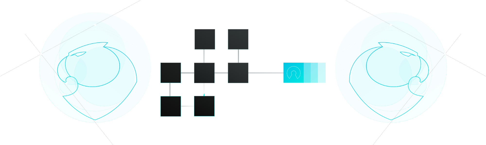
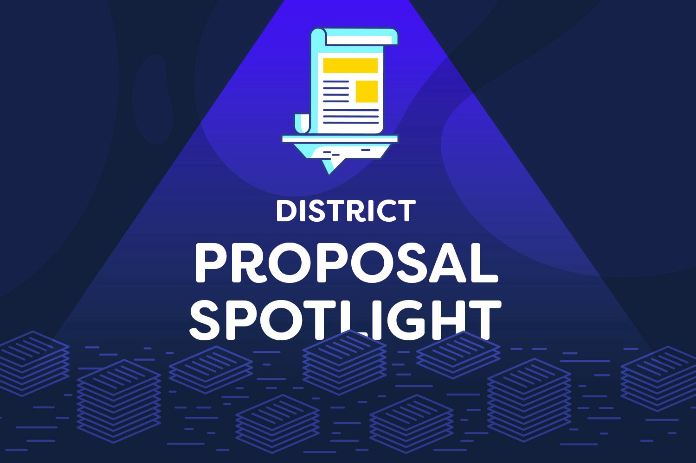
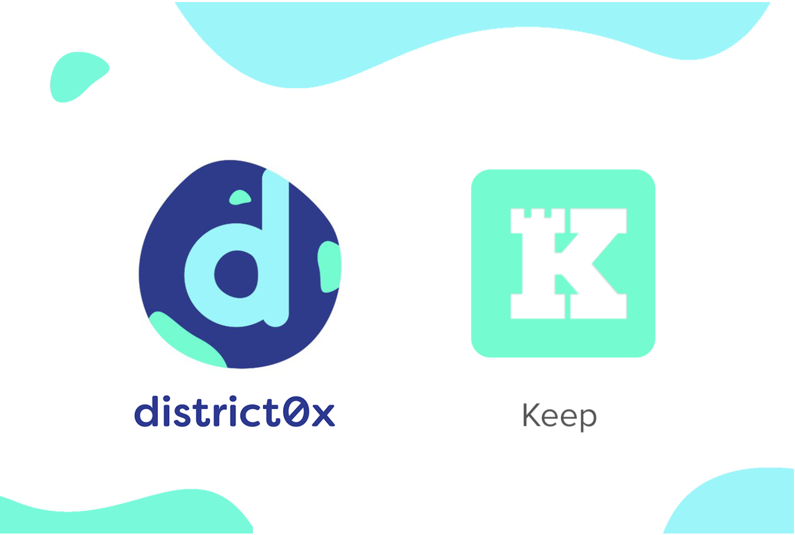
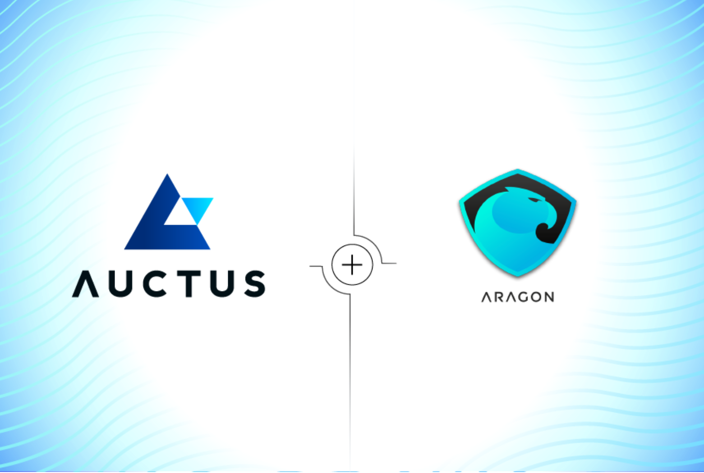
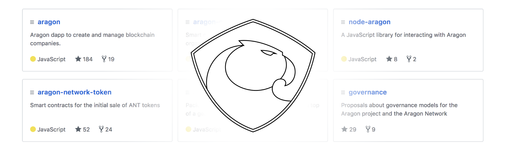
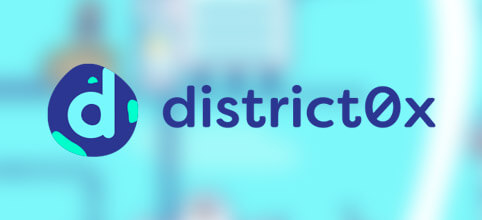
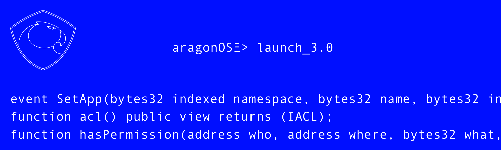
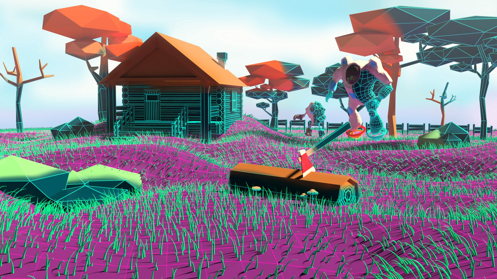

# News

## **Featured**
[<h2>Explanation of DAICOs</h2>](https://ethresear.ch/t/explanation-of-daicos/465) |
:-----------|
[_DAOs_](daos.md) |
 |
_Author [Vitalik Buterin](http://vitalik.ca/) on Jan 6_ |
**Vitalik Buterin posts a new idea about DAICOs.** The idea is as follows. A DAICO contract is published by a single development team that wishes to raise funds for a project. The DAICO contract starts off in “contribution mode”, specifying a mechanism by which anyone can contribute ETH to the contract, and get tokens in exchange. This could be a capped sale, an uncapped sale, a dutch auction, an interactive coin offering, a KYC’d sale with dynamic per-person caps, or whatever other mechanism the team chooses. Once the contribution period ends, the ability to contribute ETH stops, and the initial token balances are set; from there on the tokens can become tradeable. |
[Read More](https://ethresear.ch/t/explanation-of-daicos/465) |

[**Introducing Aragon Nest**](https://blog.aragon.one/introducing-aragon-nest-1aa8c91c0566) | [**Notes on Blockchain Governance**](http://vitalik.ca/general/2017/12/17/voting.html) | [**District Proposal Spotlight —The Bloom Lending District**](https://blog.district0x.io/district-proposal-spotlight-the-bloom-lending-district-2448a20a4470) |
:-----------:|:-----------:|:-----------:|
[_Aragon_](aragon.md) | [_DAOs_](daos.md) | [_district0x_](district0x.md) |
 |  |  |
_Author [Tatu Kärki](https://blog.aragon.one/@Smokyish) on Dec 6_ | _Author [Vitalik Buterin](http://vitalik.ca/) on Dec 17_ | _Author [P.J. Leimgruber](https://blog.district0x.io/@misterpeej) on Jan 1_ |
**A grants program to support the development of the ecosystems.** To help support the ecosystem flourish, we are introducing, together with Placeholder — lead by Joel Monegro and Chris Burniske — a grants program called Aragon Nest. The team at Placeholder has years of experience in evaluating crypto projects and teams, and we are very proud to have their expertise onboard. The goal of the program is to attract talent to research and build the necessary tooling for developing solutions around Aragon and Ethereum. | _In which I argue that “tightly coupled” on-chain voting is overrated, the status quo of “informal governance” as practiced by Bitcoin, Bitcoin Cash, Ethereum, Zcash and similar systems is much less bad than commonly thought, that people who think that the purpose of blockchains is to completely expunge soft mushy human intuitions and feelings in favor of completely algorithmic governance (emphasis on “completely”) are absolutely crazy, and loosely coupled voting as done by Carbonvotes and similar systems is underrated, as well as describe what framework should be used when thinking about blockchain governance in the first place._ | **A fully decentralized peer-to-peer lending marketplace.** district0x is thrilled to announce our partnership with Bloom to create a fully decentralized lending marketplace, the Bloom Lending District. This district will offer a standardized, transparent, peer-to-peer method for requesting and funding loans, allowing anyone with access to the internet to lend and borrow funds free of central influence. There will be no middlemen, no fees, no cross border limitations, and no constraints and will not require access to the traditional financial system — truly unleashing the power of Ethereum. |
[Read More](https://blog.aragon.one/introducing-aragon-nest-1aa8c91c0566) | [Read More](http://vitalik.ca/general/2017/12/17/voting.html) | [Read More](https://blog.district0x.io/district-proposal-spotlight-the-bloom-lending-district-2448a20a4470) |

[**Aragon Team Update: December 2017**](https://blog.aragon.one/aragon-team-update-december-2017-cf076d3a46a3) | [**Keeps on the district0x Network**](https://blog.district0x.io/keeps-on-the-district0x-network-b36619011792) | [**Auctus to leverage Aragon to become a truly decentralized platform**](https://blog.auctus.org/auctus-collaborating-with-aragon-to-become-a-truly-decentralized-platform-2fd6b4d1178c) |
:-----------:|:-----------:|:-----------:|
[_Aragon_](aragon.md) | [_district0x_](district0x.md) | [_Ecosystem_](ecosystem.md) |
 |  |  |
_Author [Tatu Kärki](https://blog.aragon.one/@Smokyish) on Jan 3_ | _Author [Alexander Khoriaty](https://blog.district0x.io/@alexander.k) on Jan 4_ | _Author [Ludmila Lopes](https://blog.auctus.org/@ludmila.omlopes) on Jan 10_ |
**Written reviews of what the team members have been up to.** Team members will produce a write-up of the most important things they have worked on since last Community Meeting, the problems they have found and what they plan to do in the next weeks (that can be a bit blurry, and that’s fine). These write-ups will be published as a blog post for the community to review on Monday before Friday’s meeting. | **Bringing private data to user-governed marketplaces.** At district0x, we have thus far largely avoided this issue by building marketplaces which rely mostly on already public cryptographic data (Name Bazaar), or relatively static information users are already comfortable making public (like freelancer or employer profiles on Ethlance). Where we’ve had to protect private data for supporting services within districts, we’ve done so with purpose-built solutions. | **Auctus announces their plans to use and integrate with Aragon.** By deploying Auctus on the Aragon Network, it will be possible to protect Auctus and it’s community from any intermediary trying to abuse its power. Furthermore, it will avoid misunderstandings between agents, keeping full record of all decision making and financial decisions. It will also allow Auctus to become truly community driven, increasing the number of stakeholders, as well as decentralizing decision making and operational processes. |
[Read More](https://blog.aragon.one/aragon-team-update-december-2017-cf076d3a46a3) | [Read More](https://blog.district0x.io/keeps-on-the-district0x-network-b36619011792) | [Read More](https://blog.auctus.org/auctus-collaborating-with-aragon-to-become-a-truly-decentralized-platform-2fd6b4d1178c) |

[**Aragon Q4 Development Update**](https://blog.aragon.one/aragon-q4-development-update-32a21935333e) | [**Aragon Q4 Transparency Report**](https://blog.aragon.one/aragon-q4-transparency-report-df3195ba6fd3) | [**An Introduction to district0x**](https://cryptoslate.com/introduction-district0x-network-decentralized-communities) |
:-----------:|:-----------:|:-----------:|
[_Aragon_](aragon.md) | [_Aragon_](aragon.md) | [_district0x_](district0x.md) |
 |  |  |
_Author [Jorge Izquierdo](https://blog.aragon.one/@izqui9) on Jan 11_ | _Author [Tatu Kärki](https://blog.aragon.one/@Smokyish) on Jan 17_ | _Author [Matt Breen](https://cryptoslate.com/author/matt-breen/) on Jan 24_ |
**Progress of development from the last quarter of 2017.** In the last quarter of 2017 we were heads down developing everything for the version 0.5 release of the Aragon Core app. Lots of progress was made, first audit of the smart contracts was conducted with good results and we’re on track to get the testnet release out really soon™. It has been an incredible quarter of building, in which we have laid down the foundation for everything that is to come in 2018. Brett and Pierre joined the development team, who together with Olivier are an amazing founding technical team. | **A recap of what has been going on with Aragon during Q4 2017** As per our Transparency Model, we do quarterly Transparency Reports of our use of funds and about the overall progress of the project. | **district0x is a network of decentralized markets and communities.** When it comes to (hopefully more successful) platforms enabling the creation and running of decentralised organisations, few can match district0x. Its team have a vision of a digital realm free of the traditional governance structures that we’ve become so accustomed to, and are well on their way to releasing a polished framework to create and run blockchain-based businesses. |
[Read More](https://blog.aragon.one/aragon-q4-development-update-32a21935333e) | [Read More](https://blog.aragon.one/aragon-q4-transparency-report-df3195ba6fd3) | [Read More](https://cryptoslate.com/introduction-district0x-network-decentralized-communities/) |

[**Launch of Aragon Nest**](https://blog.aragon.one/launch-of-aragon-nest-8d42d1a37595) | [**Introducing aragonOS 3.0 alpha**](https://blog.aragon.one/introducing-aragonos-3-0-alpha-the-new-operating-system-for-protocols-and-dapps-348f7ac92cff) | [**We are proud to announce the start of P2P Models**](https://p2pmodels.eu/) |
:-----------:|:-----------:|:-----------:|
[_Aragon_](aragon.md) | [_Aragon_](aragon.md) | [_DAOs_](daos.md) |
 |  |  |
_Author [Tatu Kärki](https://blog.aragon.one/@Smokyish) on Jan 24_ | _Author [Jorge Izquierdo](https://blog.aragon.one/@izqui9) on Jan 25_ | _Author unknown on Jan 31_ |
**Grants program is open for submissions.** At the end of 2017 we presented Aragon Nest to the community and encouraged people to start coming up with ideas for the launch.In that blog post, Introducing Aragon Nest, we outlined the reasons and goals of the program.Now the time has come to launch the program. Submissions are now open for teams to request funding as well as come up with proposals for grants. | **The new operating system for protocols and DApps.** aragonOS is smart contract development framework with a very strong focus on governance and upgradeability. This architecture can be used by any complex DApp or protocol and it allows extendability with the ability to plug in any Aragon governance module. It was originally designed to build modular DAOs, but we ended up abstracting it more and more to the point where it would be useful as the fundamental building block of any decentralized project. | **P2P Models is a €1.5M 5-year ERC research project to build decentralized, democratic, and sustainable Collaborative Economy organizations.** The Collaborative Economy is rapidly expanding, but it is dominated by centralized web platforms which hold user data and concentrate all decision-making power and profits. The idea of the P2P Models project is to tackle these issues, replacing the centralized web platform with DAOs on the blockchain, so we reduce the difference of power between the "infrastructure owner" and the user community. |
[Read More](https://blog.aragon.one/launch-of-aragon-nest-8d42d1a37595) | [Read More](https://blog.aragon.one/introducing-aragonos-3-0-alpha-the-new-operating-system-for-protocols-and-dapps-348f7ac92cff) | [Read More](https://p2pmodels.eu/) |

[**Decentraland Project Updates — January 31st**](https://blog.decentraland.org/decentraland-project-updates-january-31st-a99258b90642) | | |
:-----------:|:-----------:|:-----------:|
[_Ecosystem_](ecosystem.md) | | |
 | | |
_Author [Eric Schallock](https://blog.decentraland.org/@schallock) on Feb 1_ | | |
**News and updates from the Decentraland project.** _We’ve launched our developer CLI!_ We recently released our first development tool. _LAND Deployment._ Now that the Terraform Event has concluded, we’ve completed the process of distributing all LAND to auction participants. _New Docs._ Finally, we’d like to share with you some new documentation for Decentraland. | | |
[Read More](https://blog.decentraland.org/decentraland-project-updates-january-31st-a99258b90642) | [Submit News!](/guides/guide_for_submitting_news.md) | [Submit News!](/guides/guide_for_submitting_news.md) |

## [Submit News!](/guides/guide_for_submitting_news.md)
